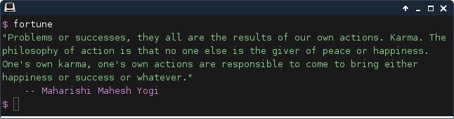

# Fortune

`fortune` is a command line script that displays a random quotation. 

It is similar to the BSD `fortune` program, originally written by Ken Arnold. Unlike Arnold's program, however, this version is written in PHP, using [Symfony](https://en.wikipedia.org/wiki/Symfony) components.

### Installation

Use [Composer](https://getcomposer.org/doc/00-intro.md#globally) to install the application:

    composer create-project jonathanmaron/fortune ~/app/fortune

### Usage

    $ ~/app/fortune/bin/fortune
    
    "A strong passion for any object will ensure success, for the desire of the end
    will point out the means."
        -- Henry Hazlitt
        
By default, `fortune` wraps lines at terminal window width. You can change this by specifying the `--wordwrap` option:

    $ ~/app/fortune/bin/fortune -wordwrap=25
    
    "Success listens only to
    applause. To all else it
    is deaf."
        -- Elias Canetti
        
To disable word wrapping specify `--wordwrap=0`.
        
It is recommended to add `fortune` to your path:

    $ cd ~/bin
    
    $ ln -s ~/app/fortune/bin/fortune fortune
    
    <log out> <log in>
    
    $ fortune
    
    "Be cool to people. Be nice to as many people as you can. Smile to as many people
    as you can, and have them smile back at you."
        -- Joe Rogan

### References

- [fortune](https://en.wikipedia.org/wiki/Fortune_(Unix)) - BSD implementation.
- [fortune](http://software.clapper.org/fortune/) - Python implementation.
- JSON files, containing quotations:
    - [famous-quotes](https://github.com/olhapi/famous-quotes)
    - [motivate](https://github.com/mubaris/motivate)
    - [Database-Quotes-JSON](https://github.com/4skinSkywalker/Database-Quotes-JSON)
